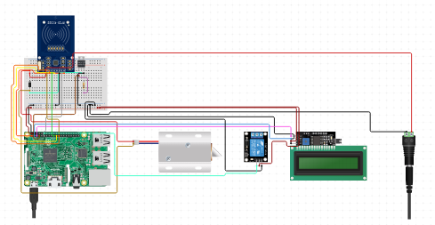

NFC Enabled Student Card System
===========================================

Copyright © 2024 Raissa Pululu. All rights reserved.
----------------------------------------------------

### Introduction

This project presents an advanced NFC Based Student Attendance Management System designed to automate attendance 
tracking, access control and a parking system using NFC/RFID technology, interfaced with Python and API integration. 
It's an ideal solution 
for educational institutions or corporate environments looking to streamline their attendance processes through modern, 
contactless identification methods.

### System Overview

The system uses NFC/RFID tags for identifying individuals, logging their attendance, access control, topping up their 
balance and a parking system automatically upon tag detection. The integration with an I2C LCD display provides 
real-time feedback, such as user identification and attendance status.

----------------------------------------------------
Hardware setup for NFC Enabled Student Card System. 

### Running the System

#### Cloning the Repository

Start by cloning the repository to obtain the latest version of the project:

`git clone https://github.com/raissalkp/NFC-Enabled-Student-Card-System`

#### Setup and Installation

1.  **Environment Preparation**: Ensure Python 3.x is installed on your system, along with all necessary libraries listed in the `requirements.txt` file (assumed to be included in your project repository).
    
2.  **Hardware Connections**: Connect your NFC/RFID reader and I2C LCD display to your Raspberry Pi or similar device according to the provided schematics.
    
3.  **Running the Main Application**: Navigate to the project directory and execute the `main.py` script to initiate the access control, attendance tracking and adding a student to the system:
`python main.py`
4. **Running the Top-Up Application**: Navigate to the project directory and execute the `top_up.py` script to initiate the top up of the balance:`python top_up.py`

5. **Running the Parking System Application**: Navigate to the project directory and execute the `parking_sys.py` script to initiate the parking system:`python parking_sys.py`

### System Structure

The system comprises several Python scripts, each serving a unique function within the attendance management ecosystem:

*   **`I2C_LCD_driver.py`**: Manages interactions with the I2C LCD display.
*   **`check_attendance.py`**: Handles attendance verification and logging.
*   **`save_user.py`**: Manages user data storage and retrieval.
*   **`scan.py`**: Interfaces with the ID scanner for user identification.
*   **`top_up.py`**: Manages account top-ups for users.
* **`parking_sys.py`**: Handles payment for parking.
*   **`unlock.py`**: Controls access mechanisms based on user authentication.
* **`main.py`**: Acts as the central script to run the application as well as the API scripts.

### Hardware Requirements

*   NFC/RFID Reader Module
*   NFC/RFID Tags or Cards
*   I2C LCD Display
* Breadboard
* GPIO Breakout Board
* 12VDC Lock-style Solenoid
* Relay Module
* Wall Adapter Power Supply
* USB-C Cable
* Jumper Wires M/M
* Jumper Wires M/F
* RFID Cards/Tags
*   Raspberry Pi (or compatible device)

### Software Dependencies

Detail any required Python libraries or dependencies in a `requirements.txt` file for easy installation using `pip install -r requirements.txt`.

### Testing the System

To ensure the system operates correctly:

1.  **Test the NFC/RFID Reader**: Verify the reader can detect and read NFC/RFID tags accurately.
2.  **LCD Feedback**: Check the I2C LCD display shows the correct information upon tag scans.
3.  **Log Attendance**: Confirm that attendance records are correctly logged in the system for each tag detected.

### System Components

*   **`I2C_LCD_driver.py`**: Manages the LCD display for feedback.
*   **`scan.py`**: Core script for interfacing with the NFC/RFID reader, responsible for detecting and processing tag information.
*   **Other Scripts**: Include details about other components like `check_attendance.py`, `save_user.py`, etc., explaining their functions within the context of NFC/RFID tag processing.

### Code References
* This project used the `I2C_LCD_driver.py` library designed by Denis Pleic, which can be found [here](https://gist.github.com/vay3t/8b0577acfdb27a78101ed16dd78ecba1) 
* This project has taken inspiration from the following projects [PiMyLifeUp](https://pimylifeup.com/raspberry-pi-rfid-attendance-system/), [SriTu Hobby](https://www.youtube.com/watch?v=p1RfcgJnHR4&t=12s), [davidcdupuis](https://github.com/davidcdupuis/NFCAttendanceLogger/blob/master/NFC.py), 
